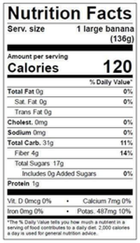
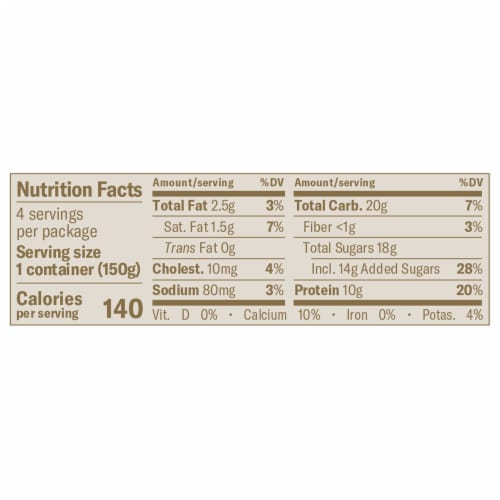
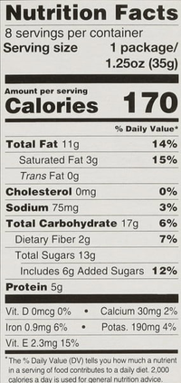

\newpage

# Documentation of Food Items

For the assignment, five packaged food items were selected: Whole Grain Bread, Banana, Yogurt, Nuts, and Salmon. The Nutrition Facts labels were photographed and analyzed to extract nutritional values per serving size. The cost per serving was calculated based on the retail prices of these items, normalized to the serving sizes provided on the labels.

## Cost Per Serving:

* Whole_Grain_Bread: $0.25
* Banana: $0.15
* Yogurt: $0.50
* Nuts: $0.55
* Salmon: $1.30

## Labels:

\newpage

# Linear Programming Problem Specification

The diet problem was specified in standard linear programming form:

* Decision Variables: The quantity of each food item to consume.
* Objective Function: Minimize the total cost of the diet.
* Constraints: Nutritional requirements set by the FDA.

# Implementation Using Python PuLP

The problem was implemented using the Python PuLP library. It was solved using the CBC MILP Solver, and the results were output to a text file.

# Solution Description

The optimal solution determined the following daily intake:

* Whole Grain Bread: 0 servings
* Banana: 0 servings
* Yogurt: 5.457 servings
* Nuts: 19.081 servings
* Salmon: 0.909 servings
* The new total daily cost of the optimal diet with additional constraints is: $14.40

# Part 5:Expanded Nutritional Constraints

I will add in the constraints of vitamin E (it was already in my dataset) and zinc which I was able to find on google in these amounts converted for serving size:

* Whole Grain Bread: 3.5
* Banana: 0.31
* Yogurt: 0.9
* Nuts: 2
* Salmon: 0.31

The addition of Vitamin E and Zinc constraints to the linear programming model represents a more comprehensive approach to meeting dietary recommendations. The revised constraints are based on the FDA's nutritional guidelines, which recommend a minimum intake of 15 milligrams of Vitamin E and 11 milligrams of Zinc for adults.

Upon incorporating these additional nutritional constraints, the optimal diet plan remained unchanged in the variety and amount of each item. This means that the added constraints were already met in the prior solution. The updated optimal diet is unchanged at:

* Whole Grain Bread: 0 servings
* Banana: 0 servings
* Yogurt: 5.457 servings
* Nuts: 19.081 servings
* Salmon: 0.909 servings
* The new total daily cost of the optimal diet with additional constraints is: $14.40
