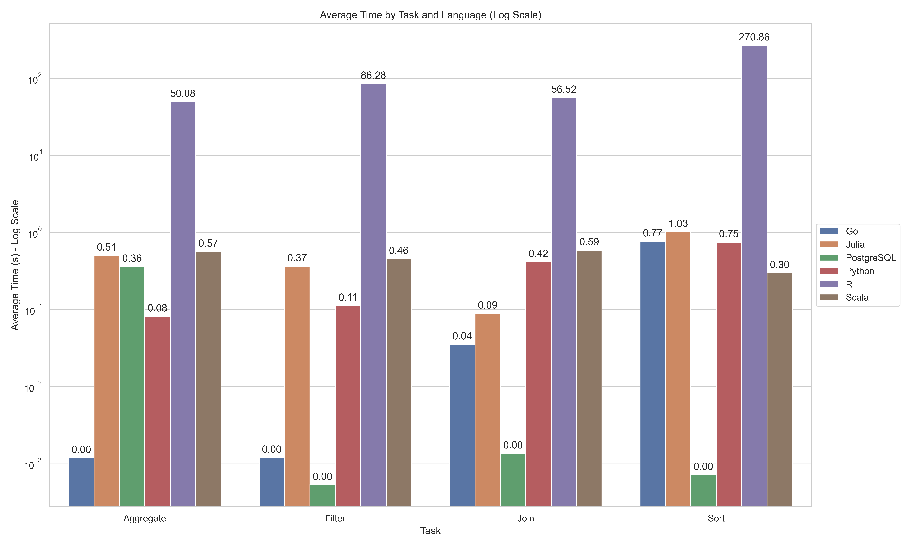
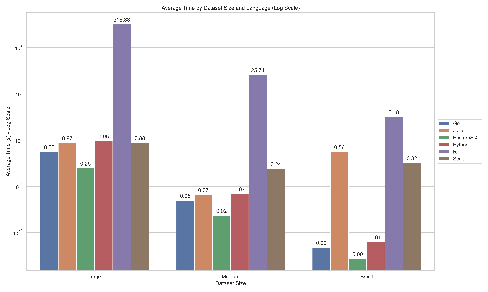

\newpage

# Introduction

## Abstract

This report details a comprehensive benchmark study of database systems using Monte Carlo simulation. Our team utilized various programming languages, including Python, R, Julia, Go, and Scala, to compare the performance of different tasks like sorting, filtering, aggregation, and joining across three dataset sizes. The study's aim was to determine the efficiency of these languages in handling database operations, providing valuable insights for data scientists and engineers in choosing the most suitable technology for their needs.

## Background

In the realm of data science, the efficiency of database operations is crucial for managing large datasets. This research was conducted to explore the performance of different programming languages in database-related tasks. The choice of language can significantly impact the processing time and memory utilization, influencing the overall efficiency of data handling and analysis.

## Literature Review

Previous studies, such as those by Hothorn et al. (2005) and Sun et al. (2015), have delved into benchmarking methods in data science and the performance of relational databases compared to graph databases. Our study contributes to this body of knowledge by comparing modern programming languages in standard database tasks using Monte Carlo simulations.

## Methods

We utilized Monte Carlo simulation to generate datasets of varying sizes (small, medium, large). The benchmarking tasks included sorting, filtering, aggregation, and joining. Each task was executed using different programming languages -- Python, R, Julia, Go, and Scala -- and their performance was measured in terms of execution time.
\newpage

# Results

The benchmarking results (see **combined_results.csv**) indicate significant variations in performance across different languages and tasks. For instance, Python showed notable efficiency in handling small and medium datasets, especially in sorting and filtering tasks. However, other languages like R and Julia demonstrated better performance with larger datasets, particularly in aggregation and joining operations.

## Schema
The **combined_results.csv** file contains benchmark results for various tasks performed in different programming languages. The data includes the following columns:

- **Task**: Specifies the type of operation performed, such as sorting, filtering, aggregation, or joining.
- **Size**: Indicates the dataset size used for the task, categorized as 'Small', 'Medium', or 'Large'.
- **Time**: The time taken to complete the task, presumably in seconds.
- **Language**: The programming language or system used for the benchmarking, like Python, R, Julia, etc.

## Exhibits

 
**Average Time by Task and Language (Log Scale):**
This plot illustrates the average execution times for different database tasks (Sort, Filter, Aggregate, Join) across various programming languages. The logarithmic scale on the y-axis provides a clear comparison despite the wide range of execution times.
 

**Average Time by Dataset Size and Language (Log Scale):**
This plot shows how each programming language handles datasets of different sizes (Small, Medium, Large). The logarithmic scale helps to effectively compare the scalability and performance of each language across different dataset sizes.

## Overall Performance by Language

The average performance times across all tasks and dataset sizes for each programming language show significant differences:

- PostgreSQL emerges as the most efficient, with the lowest average time.
- Go and Python follow, indicating good performance for general-purpose programming.
- Scala and Julia display moderate performance.
- R shows the highest average time, suggesting it might be less efficient for these specific tasks.

## Performance by Task and Language

The first visualization presents a comparison of average times for each task across different languages:

- Sorting, filtering, aggregation, and joining tasks were performed by each language.
- Languages like PostgreSQL and Go consistently show lower average times across tasks.
- Python and Scala demonstrate moderate performance, while R and Julia have higher average times, particularly in complex tasks like aggregation and joining.

## Performance by Dataset Size and Language

The second visualization compares the performance across small, medium, and large datasets for each language:

- PostgreSQL maintains superior performance across all dataset sizes.
- Go and Python show good performance, particularly in small and medium datasets.
- Scala and Julia's performance drops with increasing dataset size.
- R struggles with larger datasets, showing a significant increase in time for medium and large sizes.

## Task-Specific Insights

- Sorting: PostgreSQL and Go are the most efficient, while R and Julia lag.
- Filtering: Similar trends are observed with Go and PostgreSQL leading.
- Aggregation: This task is computationally intensive, and PostgreSQL's efficiency is particularly notable.
- Joining: A complex operation where PostgreSQL's optimization is evident.

# Conclusion

## Managerial Implications

- Efficiency and Scalability: PostgreSQL shows exceptional efficiency across tasks and sizes, making it a suitable choice for varied operations. Go and Python offer scalability, particularly for small to medium datasets.
- Task Specificity: For complex tasks like aggregation and joining, PostgreSQL's performance is noteworthy.
- Technology Selection: The choice of language should align with specific business needs -- whether it's handling large datasets or performing complex operations.

## Future Recommendations

- Diverse Workloads: Testing with a broader range of tasks and operational complexities could provide more comprehensive insights.
- Real-World Data: Implementing benchmarks with real-world datasets can validate these findings under practical conditions.

## Final Thoughts

This benchmark study provides critical insights for data scientists and engineers in selecting the most suitable technology for their data handling needs. PostgreSQL's overall efficiency, Python and Go's versatility for small to medium datasets, and the varying performance of Scala, Julia, and R across different tasks and dataset sizes are key findings that can guide technology decisions in data science and engineering.
