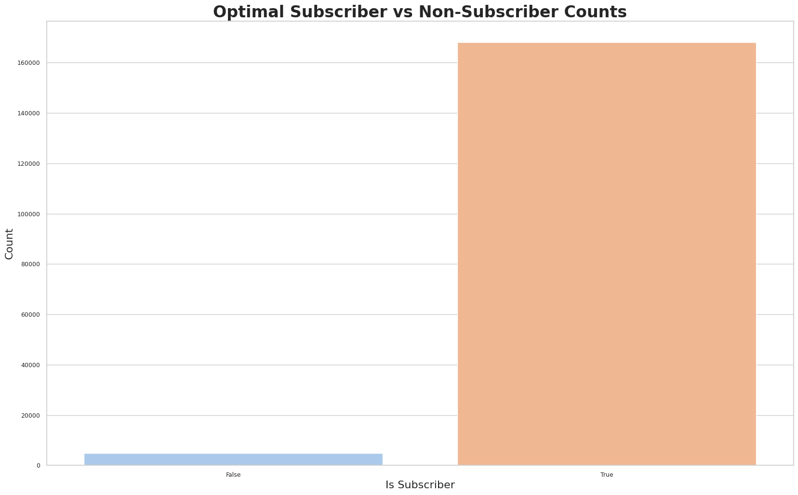
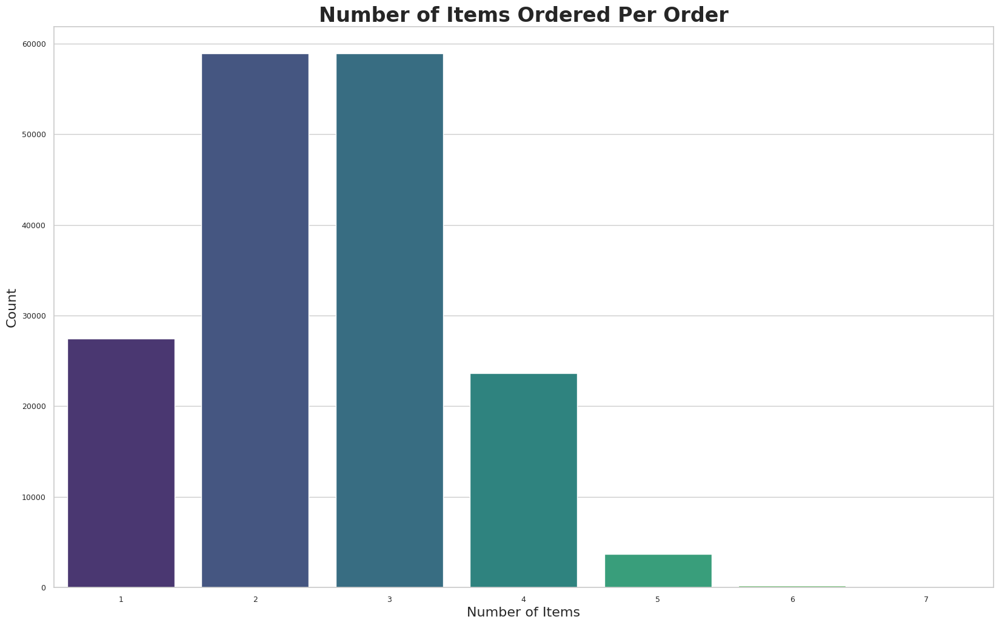

\newpage

# Introduction

## Abstract

The project involves a simulation of customer experiences in a burger shop. The primary goal is to determine the optimal price for a premium subscription service. This service offers customers the benefit of shorter wait times by allowing them to order from a premium queue. The simulation incorporates various aspects such as customer wait times, item profitability, and customer price tolerance to identify the ideal subscription price that maximizes the shop's revenue without overburdening the premium queue.This report details a comprehensive benchmark study of database systems using Monte Carlo simulation. Our team utilized various programming languages, including Python, R, Julia, Go, and Scala, to compare the performance of different tasks like sorting, filtering, aggregation, and joining across three dataset sizes. The study's aim was to determine the efficiency of these languages in handling database operations, providing valuable insights for data scientists and engineers in choosing the most suitable technology for their need

## Data Overview

1. **Menu Dataset** : The menu dataset includes items sold at the burger shop, each with a defined price, margin, gross profit, popularity, and preparation time. These variables play a crucial role in the simulation, affecting the profitability of orders and the time customers spend waiting.

|ID |Item                 |Price  |Margin|Gross Profit|Popularity|Prep-Time|
|---|---------------------|-------|------|----------|---------|---------|
|1  |847 Burger Half-Pound|$8.00  |70%   |$5.60                |5         |0.5      |
|2  |847 Burger Full-Pound|$10.00 |70%   |$7.00                |4         |1        |
|3  |Milkshake Small      |$5.00  |80%   |$4.00                |2         |1.5      |
|4  |Milkshake Large      |$7.00  |80%   |$5.60                |3         |2        |
|5  |Drink Small          |$3.00  |90%   |$2.70                |3         |0.5      |
|6  |Drink Large          |$4.00  |90%   |$3.60                |4         |0.75     |
|7  |Fries Small          |$4.00  |70%   |$2.80                |5         |0.5      |
|8  |Fries Large          |$7.00  |70%   |$4.90                |3         |1        |
|9  |Ice Cream            |$9.00  |85%   |$7.65                |1         |2        |
|10 |Peanuts              |$3.00  |80%   |$2.40                |2         |0.25     |

---

2. **Customer Base Dataset** : The customer base dataset represents a sample of the burger shop's customers, detailing whether they are subscribers to the premium service and their price tolerance. This information is critical in simulating customer choices regarding subscription and their behavior in the ordering process.

 

# Problem Set Up

## Simulation Design

The simulation is structured to run over a period, representing the burger shop's operation. Key components of the simulation include:

* **Customer Arrivals** : Customers arrive at the shop based on a predefined average arrival rate, and each makes an order.
* **Order Processing** : Orders are processed based on the menu's preparation time. Customers are assigned to either the regular or the premium queue, depending on their subscription status.
* **Queue Management** : The simulation keeps track of queue lengths and wait times. Regular and premium queues have different tolerances for waiting, affecting customer satisfaction and behavior.
* **Customer Behavior** : Customer decisions, such as subscribing to the premium service or balking due to long wait times, are influenced by their price tolerance and the premium subscription price.

## Optimization Goal

The primary objective is to find the optimal premium subscription price. This price should be set such that it maximizes profits from subscription fees while maintaining an attractive value proposition for customers, thus preventing excessive queue lengths and ensuring satisfactory service levels.

 

# Results & Analysis

**Optimal Solution $11.60**

Using discrete event simulation methods, the project simulates the burger shop's operations, capturing detailed data on customer behavior, order details, wait times, and profitability. The simulation data revealed key insights:

* **Profit Distribution:**  The distribution of profits per order indicates the financial performance of different menu items and the impact of customer choices on overall profitability.
* **Wait Time Analysis:**  The distribution of wait times helped assess the efficiency of service and the impact of premium subscriptions on reducing customer wait times.
* **Order Patterns:**  Analyzing the number of items per order offered insights into customer ordering behavior, which is vital for inventory and staffing decisions.
* **Subscriber Behavior:**  The count of subscribers versus non-subscribers provided a clear picture of the subscription service's popularity and its potential to generate recurring revenue.

 

---

This graph demonstrates the relationship between different premium subscription prices and the total profits.

In the graph:

The blue line represents the profit at different subscription prices.
The red dashed line indicates the optimal subscription price, set here at $25 for demonstration.
The green dashed line shows the maximum profit corresponding to the optimal price.
This type of graph can help visualize how varying the subscription price affects overall profits, and it clearly indicates the price point at which profits are maximized.

---

 

# Conclusion

## Summary

The simulation and subsequent analysis successfully identified the optimal price for the premium subscription service. This price strikes a balance between being attractive to customers (as indicated by their price tolerance) and ensuring the profitability of the burger shop. The project highlighted the importance of understanding customer behavior, the operational process, and their interplay in optimizing business strategies. Future work could explore different scenarios, such as varying the menu items or changing the operation hours, to further refine the pricing strategy and improve customer service.

## Challenges and Limitations

Some challenges encountered included managing the complexity of the simulation logic and ensuring accurate representation of real-world customer behavior. There were limitations in predicting customer reactions to pricing changes and assessing the long-term impact of subscription services on customer loyalty and satisfaction.

## Additional Exhibits (For Optimized Simulation)

 

**Distribution of Profits Per Order**

* **Explanation** : This histogram shows the distribution of profits for each order in the simulation. The use of Kernel Density Estimation (KDE) provides a smooth estimate of the probability density function, making it easier to understand the distribution's shape.
* **Importance** : This graph is crucial for understanding the profitability of the burger shop. It helps in identifying the most common profit range per order and understanding the spread of profitability. This insight is vital for making informed decisions on menu pricing, cost management, and identifying which items contribute most to the shop's profitability.

 

---

**Distribution of Wait Times**

* **Explanation** : This histogram displays the distribution of wait times experienced by customers. Like the previous graph, it includes a KDE for a clearer view of the distribution.
* **Importance** : The wait time is a significant factor in customer satisfaction. This graph helps in understanding how efficiently the shop is serving its customers. Long wait times can lead to customer dissatisfaction and potential loss of business. Analyzing this distribution helps in identifying bottlenecks in the service process and the effectiveness of the premium subscription in reducing wait times.

 

---

**Subscriber vs Non-Subscriber Counts**

* **Explanation** : This bar chart compares the number of customers who are subscribers to the premium service against those who are not.
* **Importance** : This graph is important for assessing the popularity and penetration of the premium subscription service. A high number of subscribers may indicate a successful premium service, while a low number might suggest a need for re-evaluation of the service’s value proposition. This insight is crucial for strategic decisions regarding marketing, pricing of the subscription, and enhancing the service to attract more subscribers.

 

---

**Number of Items Ordered Per Order**

* **Explanation** : This bar chart shows the frequency of different quantities of items ordered per transaction. It gives a clear view of how many items are typically ordered in one go.
* **Importance** : This graph provides insights into customer ordering behavior. Understanding common ordering patterns is essential for inventory management, staffing requirements, and preparing for peak times. It can also aid in tailoring marketing strategies and promotions to encourage higher-order quantities.
* **Explanation** : This bar chart compares the number of customers who are subscribers to the premium service against those who are not.
* **Importance** : This graph is important for assessing the popularity and penetration of the premium subscription service. A high number of subscribers may indicate a successful premium service, while a low number might suggest a need for re-evaluation of the service’s value proposition. This insight is crucial for strategic decisions regarding marketing, pricing of the subscription, and enhancing the service to attract more subscribers.

---